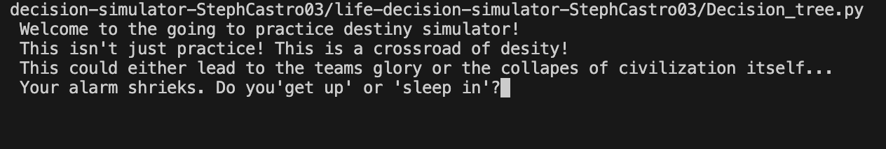
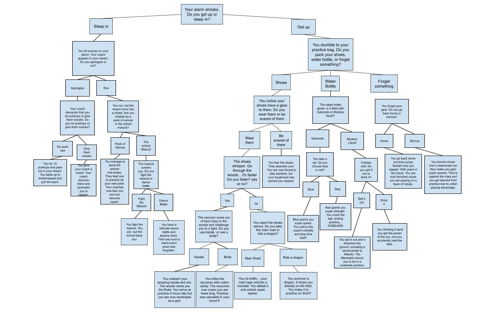

# Life Decision Simulator 
This is a life decisions simulator that is based on someone going to practice. You have to make a serie of different life choices that effects the outcome but all of the outcomes are different. Your choices will determine if your team achieves **glory** or if you caused civiliazation itself to **completely collapes.** 
## Requirements 
* Python 3 
## How to play 
1. Run the python program in you terminal: Decision_tree.py
2. Once you run the program this message will appear: 
3. The game will present you with a story and choices
 >* Type your answers exactly as they are shown in the prompts (example: get up, sleep in, yes, no)
 >* The choices are **case sensitive** (instead of GET UP, it has to be get up)
 4. Each decision branches a different way in the story, leading to different funny and wild outcomes
 ## Possible Endings
 *  🦝 Crowned Ruler of the Woods 🌲
*  💥 Banished for unfair superpowers 🦸‍♀️
* 🍫 Become team captain by feeding your coach snacks 🍪
* 🕶️ Accidentally melt the practice field ☀️
* 🚕 Summon a dragon taxi service 🐉
* ✨ Even collapse the entire universe 🌌
 ## Overall flow of the game 

## Notes
* If you type a invalid response the game will automatically send you to the end 
* This is just for fun, there is no winning or losing, only the occasional odd ending 
* The choices you make matter no ending is the same 
